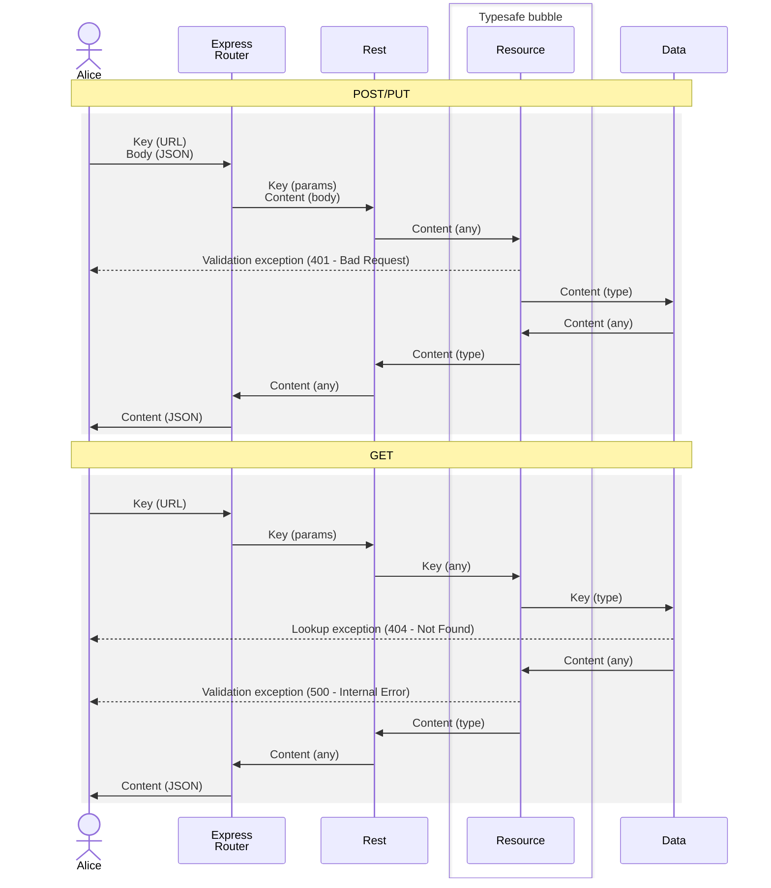

# ConClock

API and distribution server for ConClock apps.

Implements HTTP file server of:
* content in /client folder

Implements REST API with core resources of:
* /api - resource directory
* /api/time - Time syncronisation
* /api/user - User resources
* /api/event - Event / Convention / Seminar resource

## Docker Installation

* Install Docker
* Download ConClock
  * `docker pull ghcr.io/lladnaar/conclock:version`
* Run ConClock
  * `docker run -d lladnaar/conclock -p 9000:9000`

## Standalone Installation

* Install NodeJS
* Install ConClock
  * Unzip conclock.zip into new folder
  * `npm install`
* Run ConClock
  * `npm run start`

## Configuration

The default configuration is set in config.ts. To override create a config.json. Common overrides are:

* server.port: conclock server port number.
* redis.url: redis database connection url.

## Redis

As of version 0.2 you will need a redis server available on redis://redis:6379. This can be altered by setting redis.url in settings-local.json.

## Accessing ConClock

Browse to http://host:8080/ and chose the desired client.

# Development Notes

 